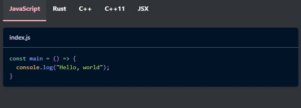

# docusaurus-remark-plugin-codetabs

Docusaurus v2 plugin to quickly create multi-language code tabs by converting code blocks to Tabs.

_**Note**: as a consequence, this only works when used with Docusaurus themes containing the `Tabs` and `TabItem` components._

_Other note: Performance is probably suboptimal. PRs are welcome._

## Installation

```bash
# npm
npm install docusaurus-remark-plugin-codetabs

# yarn
yarn add docusaurus-remark-plugin-codetabs
```

## Usage

Add the plugin to the Remark plugins array for each instance using it in `docusaurus.config.js`

```js
module.exports = {
  presets: [
    [
      '@docusaurus/preset-classic',
      {
        docs: {
          remarkPlugins: [
+           [require('docusaurus-remark-plugin-codetabs'), {
+             // options             
+           }],
          ],
        },
        blog: {
          remarkPlugins: [
+           [require('docusaurus-remark-plugin-codetabs'), {
+             // options             
+           }],
          ],
        },
      },
    ],
  ],
};
```

## Options

| Option | Type | Default | Description |
| :-: | :-: | :-: | :-- |
| `sync` | `boolean` | `false` | Whether to sync tab choices for code tabs generated with the same labels |
| `customLabels` | `Object` | `{}` | Custom default labels for languages. Entries are in the form `lang: label`. If the language already has a default label, this overrides it.

## Syntax

Code tabs are denoted by code blocks with the metastring `codetabs`. The language for the code block can be anything, but `md` should be most useful for IDE syntax highlighting.

    ```md codetabs
    ```

### Code tabs
Each code tab is delimited by the standard code block convention `````` ```[language] [metadata]``````; these can be indented any amount. 

These inner code blocks deviate in syntax from normal code blocks, however, in that they do not have closing ` ``` `; instead, the end of each inner code block is inferred by the beginning of the next, or the end of the `codetabs` code block.

Leading and trailing whitespace of the overall inner code block content is ignored.

    ```md codetabs
    ``` jsx
    <MyComponent />
      ```js
    console.log('');
    ```

### Tab labels

A default label is assigned to each tab based on its language; however, a `label=` tag can be specified in the metastring to customize the label for a tab. Labels must be delimited by either single or double quotes.

    ```. codetabs
    ```python label="Python3"
    ```

In the case of duplicate labels, the latter ones are ignored.

The group id is generated from the resultant ordered set of labels, in the form ``codetabs-${uniqueLabels.join('-')}``

### Comments

Comments are delimited by empty code block delimiters (` ``` `) on a separate line. Comment blocks will not be rendered.

Comment delimiters **must** be indented to avoid consuming the wrapping `codetabs` code block.

    ```. codetabs
        ```
    this is a comment. it will not show up.
    ```

## Suggested practices

The following are suggestions for writing clean, maintainable code tabs with this plugin.

- Leave newlines between code tabs and comments

      ```md codetabs
          ```js
      console.log("Hello, world!");

          ```
      this is a comment

          ```ts
      console.log("Foo, bar!");
      ```

Either:
  - Indent code tab delimiters, and use an empty comment at the end of each to maintain similar syntax to that of regular code blocks.

        ```md codetabs
            ```js
        console.log("Hello, world!");  
            ```

            ```ts
        console.log("Hello, world!");  
            ```
        ```
Or:
  - Do not indent code tab delimiters, and do not use empty comments. Leave empty lines between each code tab.
      
        ```md codetabs
        
        ```js
        console.log("Hello, world!");

        ```ts
        console.log("Hello, world!");

        ```

## Example

    ```md codetabs
        ```js title="index.js"
    const main = () => {
      console.log("Hello, world");
    }
        ```

        ```rust title='main.rs'
    let assignTitle: &str = r#"title="main.rs""#;
        ```

        ```cpp title="main.cpp"
    #include <iostream>
    using namespace std;
    int main() {
      cout << "Hello, world" << endl;
    }
        ```

        ```cpp label="C++11" title="main.cpp"
    string label="C++11";
        ```

        ```
    this is a comment.

        ```jsx title="Component.jsx"
    <Tabs>
      <TabItem />
      <TabItem />
    </Tabs>
        ```
    ```



## TODO / ideas

- `sync all` option? (all codetabs generated from plugin share groupid; usecase = if dedicated to sharing code or something and want people to be able to add languages but also keep everything synced idk)

- better whitespace handling so code block content doesn't have to be on the same indent level as the `codetabs` wrapper

- tests